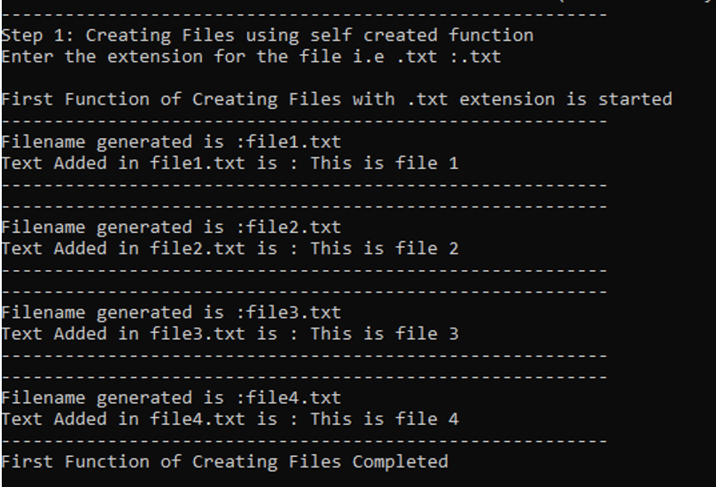
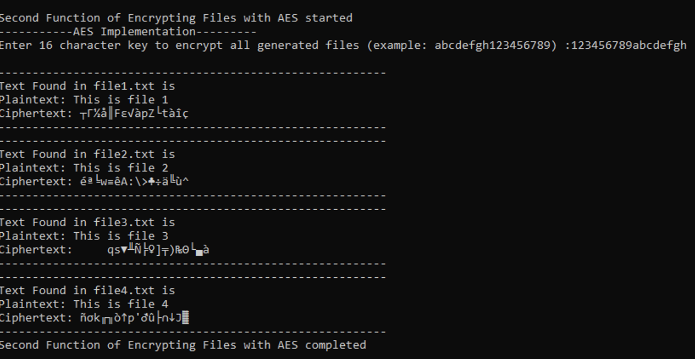
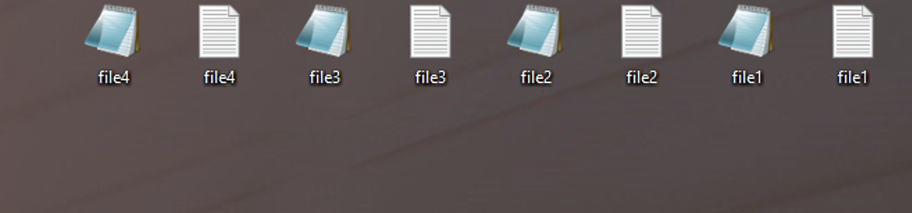
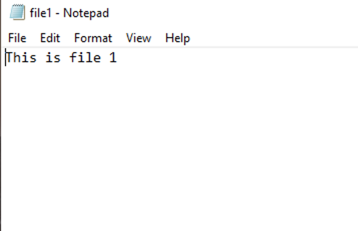
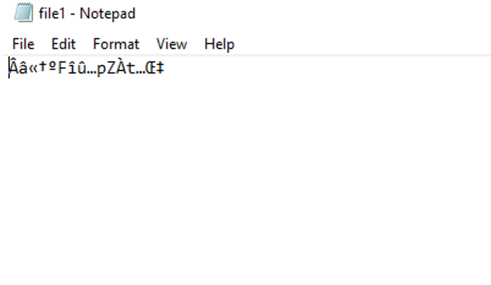

# Safe - Ransomware in C++
 
<br>
by CyberAybie

## Description

A program that demonstrates the concept of ransomware by encrypting self-generating files.

## Getting Started

### What you need?

* C++ Installed.

### Installing

* Just download the ransom.cpp file from the repository

### Executing program

#### Step 1:

* Have the cpp file pasted in desktop,
* change the path according to your desktop's path
* open terminal

```
g++ ransom.cpp -o ransom
./ransom
```
#### Executing
 * Type in a extension name for the files. (txt will work) 
 
 
 
 * Files will be encrypted using a 16 character key you used. 
 
 

 #### Results
 * Your Desktop will look like this
 
 
 
 * Plain file
 
 
 
  * Encrypted file
 
 
 
  #### Disclaimer
 * This is just for a proof of concept. I don't encourage to spread any malicious intend with this. Obviously, i could have deleted the plain files or encrypted real files on your computer but since i don't have the permission to do it and without it it's illegal that's why i have used this safest example.
 
 
## Author
 
Abrar (CyberAybie is my tag) [See my Linkedin](https://www.linkedin.com/in/cyberaybie/)

## Version History

* 0.1
    * Initial Release

## License

This project is free to use
